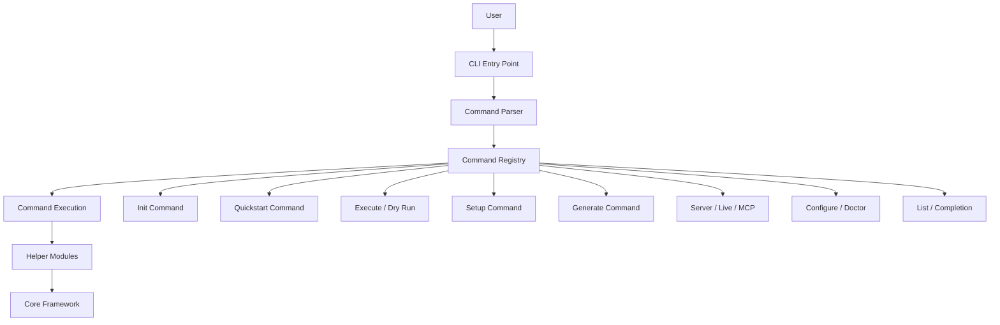
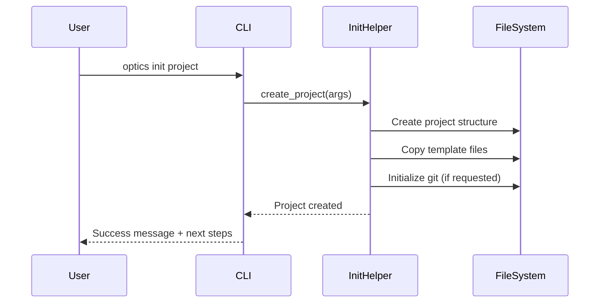
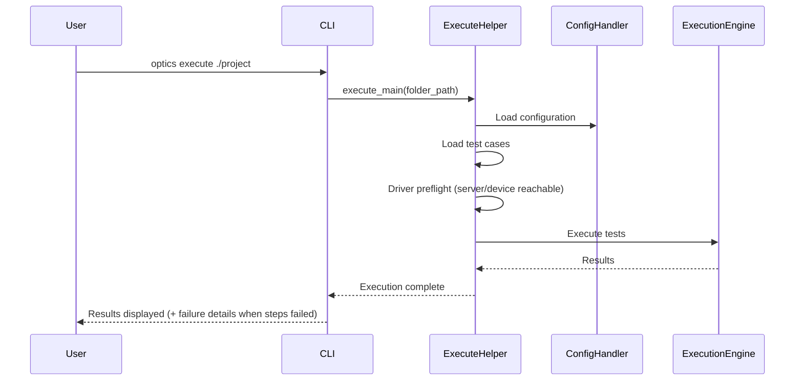
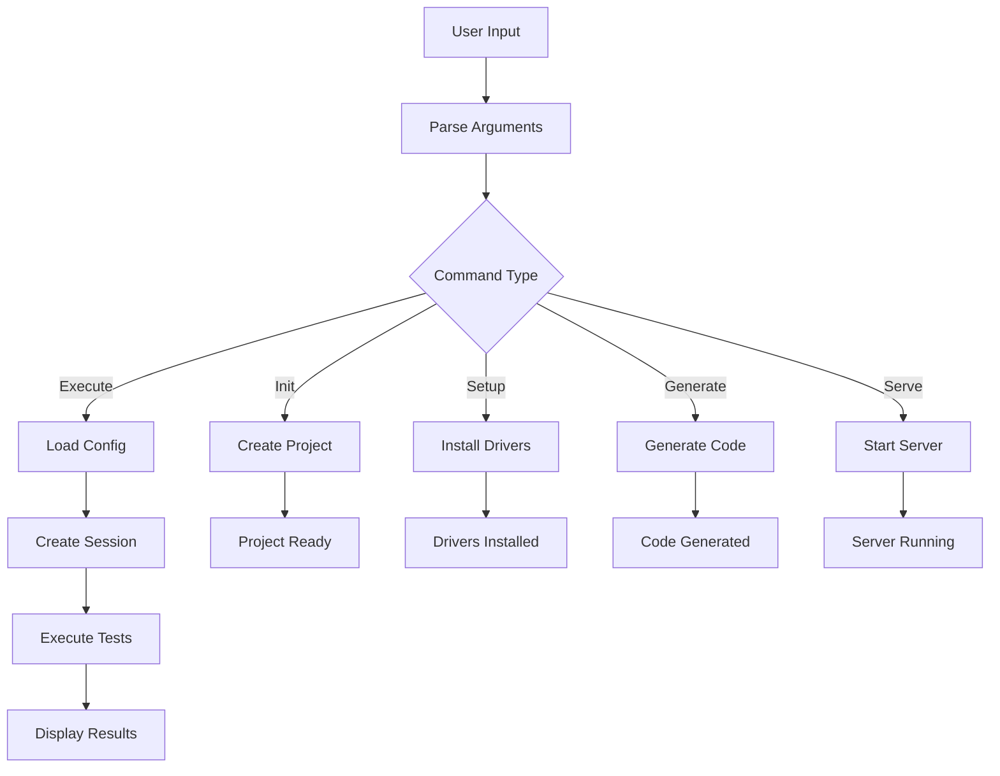

# CLI Layer Architecture

The Optics Framework provides a command-line interface (CLI) that enables users to interact with the framework without writing code. This document explains the CLI architecture, command structure, and how commands integrate with the core framework.

## Overview

The CLI layer provides:

1. **Onboarding** - `optics quickstart`, `optics doctor`, and `optics configure` take a new user from a fresh install to a runnable project and a healthy setup
2. **Project Management** - `optics init` scaffolds a project from a template
3. **Test Execution** - `optics execute` and `optics dry_run` run and validate test cases
4. **Engine Setup** - `optics setup` installs driver, OCR, and LLM backends by name
5. **Code Generation** - `optics generate` emits pytest or Robot Framework code
6. **Interactive & Agent Surfaces** - `optics live` for interactive sessions and `optics mcp` for AI-agent control
7. **API Server** - `optics serve` starts the REST API
8. **Listing & Completion** - `optics list` prints keywords; `optics completion` installs shell completions

## CLI Architecture



**Location:** `optics_framework/helper/cli.py`

## Command Structure

The CLI follows a command-based architecture where each command is a self-contained unit that:

- Registers itself with the argument parser
- Defines its arguments and options
- Executes its functionality when invoked
- Integrates with helper modules and the core framework

All commands follow a consistent pattern: registration, argument parsing, validation, and execution.

## Available Commands

### 1. Init Command

**Command:** `optics init`

**Purpose:** Initialize a new test project

**Usage:**
```bash
optics init my_project --path ./tests --template contact --git-init
```

**Arguments:**

- `name` (positional, required unless interactive): Project name (`--name` still works but is deprecated)
- `--path` (optional): Directory where project will be created
- `--template` (optional): Project template to use; omitted interactively, a picker is offered
- `--force` (flag): Override if project exists
- `--git-init` (flag): Initialize git repository

**Flow:**



### 2. Execute Command

**Command:** `optics execute`

**Purpose:** Execute test cases from a project

**Usage:**
```bash
optics execute ./my_project --runner test_runner --use-printer
```

**Arguments:**

- `folder_path` (required): Path to project folder
- `--runner` (optional): Test runner to use (default: test_runner)
- `--use-printer` / `--no-use-printer`: Enable/disable live result printer

**Flow:**



The preflight aborts with a non-zero exit and fix instructions when the enabled driver's backend is unreachable (Appium server / Android device, Selenium remote URL). `OPTICS_SKIP_PREFLIGHT=1` bypasses it.

### 3. Dry Run Command

**Command:** `optics dry_run`

**Purpose:** Validate test cases without executing actions

**Usage:**
```bash
optics dry_run ./my_project --runner test_runner
```

**Arguments:**

- `folder_path` (required): Path to project folder
- `--runner` (optional): Test runner to use
- `--use-printer` / `--no-use-printer`: Enable/disable result printer

**Behavior:** Similar to ExecuteCommand but validates test cases without performing actual actions, useful for syntax checking and validation.

### 4. Setup Command

**Command:** `optics setup`

**Purpose:** Install and configure drivers

**Usage:**
```bash
optics setup --install appium easyocr
optics setup --list
```

**Arguments:**

- `--install` (list): Drivers to install
- `--list` (flag): List available drivers

**Modes:**
- **Interactive Mode**: Launches a TUI (Text User Interface) for driver selection (quit with `q`, `Ctrl+C`/`Ctrl+Q`, or the Quit button)
- **List Mode**: Displays all available drivers
- **Install Mode**: Installs specified drivers via package manager

**Available Drivers:**
- Appium
- Selenium
- Playwright
- EasyOCR
- GoogleVision
- PyTesseract
- TemplateMatch
- RemoteOIR
- RemoteOCR

### 5. Generate Command

**Command:** `optics generate`

**Purpose:** Generate test framework code from project

**Usage:**
```bash
optics generate ./my_project --framework pytest --output test_generated.py
```

**Arguments:**

- `project_path` (required): Path to project
- `--framework` (optional): Framework to use (pytest, robot)
- `--output` (optional): Output file path

**Behavior:** Reads test cases, modules, and configuration from the project and generates executable test code in the specified framework format.

### 6. Server Command

**Command:** `optics serve`

**Purpose:** Start the REST API server

**Usage:**
```bash
optics serve --host 0.0.0.0 --port 8000 --workers 1
```

**Arguments:**

- `--host` (optional): Host to bind (default: 127.0.0.1)
- `--port` (optional): Port to bind (default: 8000)
- `--workers` (optional): Number of worker processes (default: 1)

**Behavior:** Starts a FastAPI server that exposes the framework functionality via REST API endpoints.

### 7. List Command

**Command:** `optics list`

**Purpose:** List all available keywords

**Usage:**
```bash
optics list
```

**Behavior:** Scans the framework API package and displays all available keywords that can be used in test cases, along with their parameters and descriptions.

### 8. Configure Command

**Command:** `optics configure [folder] [--edit]`

**Purpose:** Write or edit a project's `config.yaml` (configuration is project-specific; there is no global config)

**Usage:**
```bash
optics configure myproject          # guided Q&A → rendered config.yaml
optics configure myproject --edit   # full-field Textual editor
```

**Behavior:** The default path first confirms overwrite when a `config.yaml` already exists (declining aborts before any question is asked), then walks the user through platform questions and writes the rendered, commented `config.yaml`. `--edit` launches the interactive configuration manager over every config field of that project.

!!! note "Deprecated alias"
    `optics config` prints a deprecation notice and forwards to the editor for the current directory.

### 9. Doctor Command

**Command:** `optics doctor [folder] [--check]`

**Purpose:** Diagnose the environment (Python, engines, adb/Appium, browsers) and, when a folder is given, validate that project's `config.yaml`

**Usage:**
```bash
optics doctor                     # environment only
optics doctor myproject           # environment + project config
optics doctor myproject --check   # exit non-zero if a project check fails (CI)
```

**Behavior:** Prints a ✅/⚠️/❌ table with a fix command for each row. Environment gaps are warnings; project-config problems are failures. Run without a project folder, it adds a ⚠️ row pointing you to `optics quickstart` instead of staying silent about the missing config. When the enabled driver's own requirements are unmet (e.g. Appium server unreachable or no device attached), the closing line lists exactly those blockers instead of the all-clear reassurance. Parses `config.yaml` with `yaml.safe_load` only — it never mutates the project it inspects. `--check` exits non-zero when any project-config row fails.

### 10. Quickstart Command

**Command:** `optics quickstart`

**Purpose:** Guided, end-to-end walkthrough for a first project

**Usage:**
```bash
optics quickstart
```

**Behavior:** Prints the welcome banner, asks what you want to automate, offers to install the matching engine, scaffolds a project, generates a platform-correct `config.yaml` from a short Q&A, runs `doctor` to verify, and prints the next steps. It never runs your tests itself.

### 11. Completion Command

**Command:** `optics completion`

**Purpose:** Enable shell autocompletion

**Usage:**
```bash
optics completion
```

**Behavior:** Generates the completion scripts under `~/.optics/`, then asks for confirmation before appending the `source` line to the shell RC file (`.bashrc`, `.zshrc`). On decline — or without an interactive terminal — it prints the line to add manually and leaves RC files untouched.

### 12. Live Command

**Command:** `optics live [folder]`

**Purpose:** Open an interactive terminal session to run keywords against a live target, with recording always on

**Usage:**
```bash
optics live                # uses the config.yaml in the current directory
optics live my_project     # uses that project's config.yaml
```

**Behavior:** Driver-agnostic and config-driven — the single enabled driver in `config.yaml` is the target. Each successful keyword is buffered; `/save <test_case> <module_name>` appends the recording to `modules/modules.csv`, `test_cases/test_cases.csv`, and `elements/elements.csv`. `Ctrl-N` toggles a natural-language mode where an LLM drives the keywords from a plain-English goal (needs the `llm` extra). See [Live Usage](../usage/live_usage.md).

### 13. MCP Command

**Command:** `optics mcp [--transport stdio|http]`

**Purpose:** Run an MCP server that exposes every keyword as a typed tool and device state as resources, so an AI client can drive a real target

**Usage:**
```bash
optics mcp                                  # stdio transport (default; local clients like Claude Desktop)
optics mcp --transport http --port 8090     # networked
```

**Behavior:** A thin in-process wrapper over the REST engine — it reuses the keyword machinery, not a reimplementation. `start_session` -> observe (`screenshot`, `optics://session/{id}/source`) -> act (`press_element`, `enter_text`, ...) -> `terminate_session`. Sessions are **not** shared with `optics serve`; each is its own process. Requires the optional `mcp` extra (`pip install "optics-framework[mcp]"`). See [MCP Usage](../usage/mcp_usage.md).

## Helper Modules

The CLI layer delegates complex operations to helper modules that encapsulate specific functionality:

### Execute Helper

**Location:** `optics_framework/helper/execute.py`

**Responsibilities:**

- Loads configuration and test cases from project
- Creates and manages test sessions
- Executes tests via ExecutionEngine
- Manages live result printing and output formatting

### Initialize Helper

**Location:** `optics_framework/helper/initialize.py`

**Responsibilities:**

- Creates project directory structure
- Copies template files and configurations
- Initializes git repository (optional)
- Sets up initial configuration files

### Generate Helper

**Location:** `optics_framework/helper/generate.py`

**Responsibilities:**

- Reads test cases, modules, and elements from project
- Converts project structure to target framework format (pytest/Robot Framework)
- Generates executable test code
- Writes generated code to output file

### Setup Helper

**Location:** `optics_framework/helper/setup.py`

**Responsibilities:**

- Lists available drivers and their dependencies
- Installs driver packages via package manager
- Provides interactive TUI for driver selection
- Validates driver installations

### Config Manager

**Location:** `optics_framework/helper/config_manager.py`

**Responsibilities:**

- Interactive configuration file editor
- Configuration validation and error checking
- Configuration file management (create, read, update)
- Configuration template generation

### Serve Helper

**Location:** `optics_framework/helper/serve.py`

**Responsibilities:**

- Configures and starts Uvicorn server
- Sets up FastAPI application with routes
- Manages server lifecycle (start, stop, restart)
- Handles server configuration and logging

## Error Handling

The CLI includes comprehensive error handling with appropriate exit codes:

**Exit Codes:**
- `0`: Success
- `1`: Unexpected error
- `2`: Argument error
- `3`: Value error
- `130`: User cancellation (Ctrl+C)

Error handling covers:

- User input validation
- Configuration errors
- Execution failures
- Resource errors
- User interruptions

## Integration with Core Framework

### Session Creation

CLI commands that execute tests create sessions through the `SessionManager`. The session encapsulates all test execution state, including configuration, test cases, and component instances.

### Execution

Test execution commands use the `ExecutionEngine` to orchestrate test runs. The engine handles test case parsing, keyword execution, result collection, and event publishing.

### Configuration Loading

Commands load configuration from the project's own `config.yaml` through `ConfigHandler`. There is no global config layer — each project directory is self-contained.

## Command Execution Flow



## Best Practices

### 1. Command Design

- Use descriptive command names that clearly indicate purpose
- Provide clear help text and documentation
- Validate arguments early in the execution flow
- Use structured models for argument validation

### 2. Error Messages

- Provide clear, actionable error messages
- Include suggestions for fixing common errors
- Use appropriate exit codes for different error types
- Log detailed errors for debugging while showing user-friendly messages

### 3. User Experience

- Provide progress indicators for long-running operations
- Use consistent output formatting across commands
- Support both interactive and non-interactive modes
- Offer helpful suggestions when commands fail

### 4. Integration

- Reuse core framework components rather than duplicating logic
- Delegate complex operations to helper modules
- Maintain clear separation between CLI layer and core framework
- Use helper modules for operations that require multiple framework components

## Extending the CLI

To add a new command:

1. **Create Command Class**: Define a command class that registers arguments and implements execution logic
2. **Register Command**: Add the command to the command registry in the main CLI entry point
3. **Create Helper Module** (if needed): For complex operations, create a helper module that encapsulates the functionality

The CLI architecture is designed to be extensible, allowing new commands to be added without modifying existing code.

## Troubleshooting

### Command Not Found

**Problem:** Command not recognized

**Solutions:**

1. Verify command is registered in the CLI entry point
2. Check command name spelling
3. Verify CLI installation is complete

### Argument Errors

**Problem:** Invalid arguments

**Solutions:**

1. Check argument names and types
2. Review command help: `optics <command> --help`
3. Verify required arguments are provided

### Execution Failures

**Problem:** Command execution fails

**Solutions:**

1. Check error messages for details
2. Verify configuration is correct
3. Check dependencies are installed
4. Review logs for more information

## Related Documentation

- [API Layer](api_layer.md) - REST API server architecture
- [Library Layer](library_layer.md) - Python library interface
- [Execution](execution.md) - Test execution architecture
- [Configuration](../configuration.md) - Configuration management
- [CLI Usage Guide](../usage/CLI_usage.md) - CLI usage examples
