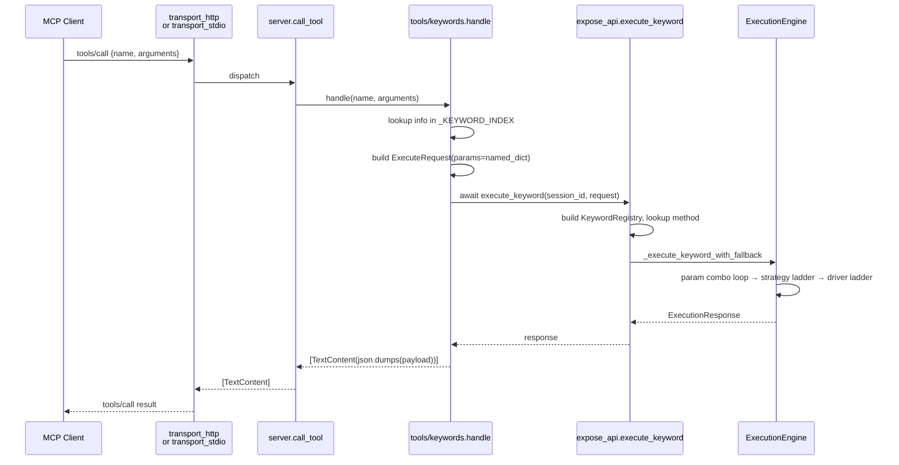

# MCP Server Architecture

The MCP layer turns the Optics keyword surface into tools an AI client can call over the [Model Context Protocol](https://modelcontextprotocol.io). It is a **thin transport translator** over the existing FastAPI handlers in [`expose_api`](api_layer.md) — session lifecycle, keyword dispatch, the three fallback ladders, and event publishing are reused unchanged.

## Overview

The MCP layer provides:

1. **Capability fan-out** — a single `Server("optics-framework")` instance delegates to per-capability tool registries (session / inspect / keyword).
2. **Auto-generated keyword tools** — one MCP tool per entry in `expose_api.discover_keywords()`, schemas built from the keyword signatures.
3. **Two transports** — streamable HTTP (Starlette + the MCP SDK's `StreamableHTTPSessionManager`) for hosted clients; stdio for local clients.
4. **Zero duplication** — every MCP call ends up in `expose_api.execute_keyword`, so the MCP path inherits exactly the same behaviour as the REST path.

```mermaid
graph TB
    A[MCP Client<br/>Claude Desktop / claude.ai / Cursor] --> B{Transport}
    B -->|stdio| C[transport_stdio.py]
    B -->|HTTP POST /mcp| D[transport_http.py<br/>Starlette]
    C --> E[Server&#40;optics-framework&#41;]
    D --> E
    E --> F[tools/session.py]
    E --> G[tools/inspect.py]
    E --> H[tools/keywords.py]
    F --> I[expose_api.create_session]
    G --> J[expose_api.run_keyword_endpoint]
    H --> K[expose_api.execute_keyword]
    I --> L[SessionManager]
    J --> K
    K --> M[ExecutionEngine + KeywordRegistry]
```



**Location:** `optics_framework/mcp/`

## File layout

```
optics_framework/mcp/
├── __init__.py
├── server.py             # Server + list_tools/call_tool/list_prompts
├── transport_http.py     # Starlette app, /mcp + /healthz + /
├── transport_stdio.py    # stdio_server adapter
└── tools/
    ├── __init__.py
    ├── session.py        # optics_start_session, _terminate_session, _list_sessions
    ├── inspect.py        # optics_screenshot, _page_source, _screen_elements, ...
    └── keywords.py       # auto-generated optics_<keyword> tools
```

## Server core (`server.py`)

A single `mcp.server.Server` instance dispatches via an **O(1) route map** built once at import time from each capability module's `tool_names()`. There's no per-call fan-out: `call_tool` does a dict lookup and invokes exactly the owning handler.

```python
server = Server("optics-framework")

ALL_TOOLS = (
    session_tools.TOOL_DEFINITIONS
    + inspect_tools.TOOL_DEFINITIONS
    + keyword_tools.TOOL_DEFINITIONS
)

def _build_route_map() -> dict[str, _Handler]:
    routes = {}
    for module in (session_tools, inspect_tools, keyword_tools):
        for name in module.tool_names():
            if name in routes:
                raise RuntimeError(f"duplicate MCP tool name: {name}")
            routes[name] = module.handle
    return routes

_ROUTES = _build_route_map()

@server.call_tool()
async def call_tool(name, arguments):
    handler = _ROUTES.get(name)
    if handler is None:
        raise LookupError(f"unknown tool: {name}")
    return await handler(name, arguments or {})
```

Two things to notice:

1. **Duplicate-name guard.** If two capability modules ever claim the same tool name, `_build_route_map` fails loudly at import — much louder than the previous fan-out, which would have silently routed to whichever handler was first in the tuple.
2. **`call_tool` raises on unknown / missing.** The MCP SDK's `@server.call_tool()` decorator catches `Exception` and returns a `CallToolResult(isError=True, content=[TextContent(text=str(e))])`. Raising is the documented way to signal a tool failure; returning JSON like `{"error": "..."}` would be marked `isError=False`, fooling the client into treating the failure as success.

The server also registers a single `list_prompts` / `get_prompt` pair that serves an **operator system prompt**. Clients that pick up MCP prompts automatically get instructions on the recommended workflow (start session → inspect → drive → terminate).

## Capability modules

Every capability module exposes three things:

```python
TOOL_DEFINITIONS: list[mcp_types.Tool] = [...]

def tool_names() -> set[str]:
    return {t.name for t in TOOL_DEFINITIONS}

async def handle(name: str, arguments: dict) -> list[mcp_types.TextContent] | None:
    if name == "optics_thing":
        return _ok(payload)              # success
    if name == "optics_thing2":
        raise ValueError("bad input")    # failure -> SDK sets isError=True
    return None                          # not my tool (defensive; route map should prevent this)
```

`tool_names()` is what the server's route builder consults. `handle()` is called only for tools the module owns, so the `if/elif` chain inside is just for routing within the module — there is no cross-module fan-out anymore.

**Error contract:** handlers raise on failure rather than returning structured error payloads. `ValueError` for bad input, `LookupError` for missing sessions, `RuntimeError` for downstream failures (re-raised from `HTTPException` with status + detail preserved as `"500: boom"` style messages).

### `tools/session.py`

Three tools wrap session lifecycle:

| Tool | Delegates to |
|------|--------------|
| `optics_start_session` | `expose_api.create_session(SessionConfig(**arguments))` |
| `optics_terminate_session` | `session_manager.terminate_session(session_id)` |
| `optics_list_sessions` | reads `session_manager.sessions` |

`optics_start_session` accepts the same `SessionConfig` schema as the REST `POST /v1/sessions/start` endpoint — `driver_sources`, `elements_sources`, `text_detection`, `image_detection`, `project_path`, `api_data`. Each is a list of either source-name strings or single-key dicts mapping a source name to `{enabled, url, capabilities}`.

### `tools/inspect.py`

Five read-only tools wrap the existing REST inspect endpoints:

| Tool | Underlying keyword |
|------|-------------------|
| `optics_screenshot` | `capture_screenshot` |
| `optics_page_source` | `capture_pagesource` |
| `optics_screen_elements` | `get_screen_elements` |
| `optics_interactive_elements` | `get_interactive_elements` |
| `optics_driver_session_id` | `get_driver_session_id` |

Each one calls `expose_api.run_keyword_endpoint(session_id, keyword)`, which in turn calls `execute_keyword` — same dispatch path as a normal keyword call.

### `tools/keywords.py` — the auto-generator

This is the centerpiece. At import time it walks `optics_framework.api.*` itself and collects every public method's `inspect.Signature`:

```python
@dataclass(frozen=True)
class _KeywordSpec:
    slug: str             # "press_element"
    human: str            # "Press Element" — what execute_keyword expects
    signature: inspect.Signature
    doc: str

def _discover_specs() -> list[_KeywordSpec]:
    specs = []
    for _, modname, ispkg in pkgutil.iter_modules(api_pkg.__path__):
        ...
        for _, cls in inspect.getmembers(mod, predicate=inspect.isclass):
            for mname, meth in inspect.getmembers(cls, predicate=inspect.isfunction):
                if mname.startswith("_") or mname.startswith("test"):
                    continue
                specs.append(_KeywordSpec(
                    slug=mname,
                    human=_humanize(mname),
                    signature=inspect.signature(meth),
                    doc=(inspect.getdoc(meth) or "").strip(),
                ))
    return specs
```

#### Why not `expose_api.discover_keywords()`?

The REST API's `KeywordInfo` model collapses two distinct cases — *"no default"* and *"default is literally `None`"* — into the same `KeywordParameter.default = None`. Code consuming `KeywordInfo` cannot distinguish a required `def f(x: str)` from an `Optional[str] = None`. Driving the MCP schema's `required` array off `default is None` would mark every `Optional[X] = None` parameter as required, lying to the LLM about ~28 real Optics keywords (`event_name`, `template_image`, `app_activity`, …).

Re-introspecting from `inspect.Signature` gives us the real `Parameter.empty` sentinel, and lets us reach the actual type objects (not their string repr) for `typing.get_origin` / `typing.get_args`. Two birds, one source of truth.

#### Schema generation

`_annotation_to_schema(annotation)` walks the type at the object level, not its string form:

```python
def _annotation_to_schema(annotation):
    if annotation is inspect.Parameter.empty or annotation is typing.Any:
        return {"type": "string"}
    origin = typing.get_origin(annotation)
    args = typing.get_args(annotation)
    if origin is typing.Union or origin is types.UnionType:    # Optional / PEP 604
        non_none = [a for a in args if a is not type(None)]
        if len(non_none) == 1:
            return _annotation_to_schema(non_none[0])
        return {"anyOf": [_annotation_to_schema(a) for a in non_none]}
    if origin in (list, typing.List):
        return {"type": "array", "items": _annotation_to_schema(args[0] if args else typing.Any)}
    if origin in (dict, typing.Dict):
        return {"type": "object"}
    if isinstance(annotation, type):
        # bool MUST be checked before int because issubclass(bool, int)
        if annotation is bool: return {"type": "boolean"}
        ...
```

The seven distinct annotations actually used across the Optics API classes (verified by enumeration) all flow through cleanly — `Optional[List[str]]` becomes `{"type": "array", "items": {"type": "string"}}`, `Union[str, List[Any]]` becomes an `anyOf`, etc.

#### Dispatch

```python
async def handle(name, arguments):
    spec = _KEYWORD_INDEX.get(_tool_name_to_slug(name))
    if spec is None:
        return None
    session_id = arguments.get("session_id")
    if not session_id:
        raise ValueError("session_id is required (call optics_start_session first)")
    named = {k: v for k, v in arguments.items() if k != "session_id"}
    request = ExecuteRequest(mode="keyword", keyword=spec.human, params=named)
    try:
        response = await execute_keyword(session_id, request)
    except HTTPException as e:
        raise RuntimeError(f"{e.status_code}: {e.detail}") from e
    return _ok(response.model_dump())
```

The `params=named` shape (dict, not list) lines up with `expose_api._build_named_param_context`, so the existing fallback-combo logic kicks in automatically when the model passes a list for a `List[str]` parameter.

### Blocklist

Six keyword slugs are hidden from the auto-generated tool list because they're already covered elsewhere:

| Slug | Why hidden |
|------|-----------|
| `launch_app`, `close_and_terminate_app` | Handled by `optics_start_session` / `optics_terminate_session`. |
| `capture_screenshot`, `capture_pagesource`, `get_screen_elements`, `get_interactive_elements`, `get_driver_session_id` | Exposed by `tools/inspect.py` with friendlier names. |
| `run_loop`, `execute_module`, `condition` | Runner-only flow control — only meaningful inside a CSV/YAML test-case graph. |

To unhide one, remove it from `_BLOCKLIST` in `tools/keywords.py`. To hide a new one, add the slug.

## Transports

### Streamable HTTP (`transport_http.py`)

A Starlette app mounting the MCP SDK's `StreamableHTTPSessionManager`:

```python
_session_manager = StreamableHTTPSessionManager(app=mcp_server, stateless=False)

async def _handle_mcp(scope, receive, send):
    await _session_manager.handle_request(scope, receive, send)
```

The handler is mounted via a custom `_RawASGIRoute`, **not** Starlette's `Mount`. The reason: `Mount("/mcp", ...)` appends a `/{path:path}` parameter and 307-redirects bare `/mcp` to `/mcp/`. MCP clients POST to `/mcp` exactly, and a 307 drops the request body — the server then sees an empty initialization and the session never starts. The raw route matches the exact path with no rewrite.

CORS is wired with `allow_origins` configurable via `--cors-origin` (default `*`), `allow_methods=["GET", "POST", "OPTIONS"]`, and `expose_headers=["Mcp-Session-Id", "WWW-Authenticate"]` so MCP session IDs survive cross-origin responses.

Two extra routes ship for ops:

- `GET /healthz` — liveness probe (returns `{"ok": true}`)
- `GET /` — discovery (returns `{"service", "version", "mcp_endpoint"}`)

### stdio (`transport_stdio.py`)

A minimal wrapper around `mcp.server.stdio.stdio_server`:

```python
async def _run():
    async with stdio_server() as (read_stream, write_stream):
        await server.run(read_stream, write_stream, server.create_initialization_options())

def run_stdio():
    asyncio.run(_run())
```

There's no auth surface in stdio — the client process started the server, so the trust boundary is process-local.

## CLI integration

The `optics mcp` subcommand lives in `helper/cli.py` as `MCPCommand`. The transport is chosen by `--transport` (default `http`); HTTP-only flags (`--host`, `--port`, `--cors-origin`) are ignored under stdio.

```python
class MCPCommand(Command):
    def execute(self, args):
        if args.transport == "stdio":
            from optics_framework.mcp.transport_stdio import run_stdio
            run_stdio()
            return
        import uvicorn
        from optics_framework.mcp.transport_http import create_app
        origins = tuple(args.cors_origin) if args.cors_origin else ("*",)
        app = create_app(cors_allowed_origins=origins)
        uvicorn.run(app, host=args.host, port=args.port, log_config=None)
```

The transport modules are imported lazily inside `execute()` so booting `optics --help` doesn't pull in the MCP SDK.

## Request flow

A keyword call from an MCP client follows this path:



The three fallback ladders documented in [CLAUDE.md](https://github.com/mozarkai/optics-framework/blob/main/CLAUDE.md#three-fallback-ladders--keep-them-straight) fire exactly as they do for the REST path, because the call goes through the same `execute_keyword`.

## Session sharing with `optics serve`

Both `optics mcp` and `optics serve` import the **same module-level `session_manager`** instance from `expose_api`. Run them in the same process and sessions are shared:

- A session started over MCP is visible at `GET /v1/sessions/{id}/screenshot`.
- A session started over REST can be driven from an MCP client.

Run them in **separate processes** and each has its own `session_manager` — sessions are not shared across processes.

## Adding a new tool

Three patterns, depending on what you're adding:

1. **A new Optics keyword** → add the method to one of the API classes in `optics_framework/api/`. It will be auto-discovered by `discover_keywords()` and exposed as an MCP tool on the next server start. No changes to the MCP layer required.

2. **A custom MCP tool that doesn't map 1-to-1 to a keyword** (e.g. a composite "find-and-press" tool, an external integration) → add a new module under `optics_framework/mcp/tools/`, give it `TOOL_DEFINITIONS` and `handle(name, arguments)`, then add it to the `(session_tools, inspect_tools, keyword_tools)` fan-out tuples in `server.py`.

3. **A new transport** (e.g. WebSocket, gRPC) → mirror `transport_http.py` / `transport_stdio.py`. Wire it into `MCPCommand` in `helper/cli.py` under a new `--transport` choice.

## Testing

Unit tests live in `tests/units/mcp_server/test_mcp_tools.py`. The test directory is named `mcp_server/` (not `mcp/`) to avoid shadowing the top-level `mcp` package — a `tests/units/mcp/` package would make `from mcp import types` resolve to the test directory instead of the SDK.

The async handlers are exercised via `asyncio.run` rather than `pytest-asyncio` to avoid adding another test dependency. Coverage:

- Schema generation (every tool requires `session_id`, blocklist holds)
- `_annotation_to_schema` against every real Optics annotation shape
- `Optional[X] = None` is NOT marked required (regression test for the bug that motivated re-introspection)
- Required-without-default parameters ARE marked required
- Defaulted parameters keep their default in the schema
- Handler returns `None` for unknown tools (defensive; route map should prevent this)
- Handler raises `ValueError` on missing `session_id` (no error JSON returned)
- Handler raises `RuntimeError` with `"{status}: {detail}"` on `HTTPException`
- Handler dispatches into `execute_keyword` with the right `ExecuteRequest`
- Session handlers use the public `list_session_ids()` API
- `optics_start_session` schema describes the nested `{source: {url, capabilities, ...}}` shape
- Server route map covers every advertised tool
- `SessionManager.list_session_ids()` public method works on real instances

## Hard rules

1. **Don't `from optics_framework.mcp import *` inside `optics_framework/`.** The MCP package transitively imports the `mcp` SDK; importing it eagerly at package import time would force every user of `optics-framework` to install `mcp`. Lazy imports inside `MCPCommand.execute` keep that surface optional.
2. **`tests/units/mcp_server/` not `tests/units/mcp/`.** See above — the latter shadows the SDK and breaks every test in the directory.
3. **Don't reimplement `execute_keyword`.** The whole point of the layer is that one path executes keywords. Adding parallel execution paths in the MCP layer would re-introduce all the bugs the FastAPI path has already squashed.
