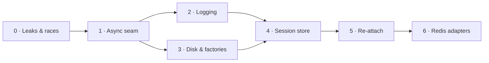

# Phase Plans

:material-progress-clock: **Status: In progress** — Phase 0 has landed. Phases 1–6 are planned at the level below and not started.

Two levels of plan exist, and the difference matters:

- **Phase-level plans (this page)** — scope, task breakdown, sequencing, exit criteria and risks for all seven phases. Stable; written once.
- **Executable TDD task plans** — the bite-sized, test-first, per-task documents an implementer works from, like the [Phase 0 plan](../superpowers/plans/2026-08-18-phase0-session-leaks-and-races.md). These are written **immediately before each phase runs**, because they carry exact line anchors and depend on the state the previous phase left behind. Writing them all now would guarantee they are wrong by the time they are used — Phase 0's own plan contained four defects that were nonexistent symbols and stale paths, and it was written the same day it ran.

Finding IDs (`A1`, `E2`, `G1`, …) refer to the [audit](../superpowers/specs/2026-08-18-parallel-sessions-audit.md). Full context in the [Program Reference](program-reference.md).

## Dependency order

Phases 2 and 3 are independent of each other and can run in either order, or in parallel. Everything else is strictly sequential.

**Phases 0–3 carry no new dependency** and improve `optics execute` and `optics live` as well as the server — they are worth landing even if the stateless work never happens. **Phases 4–6** deliver cross-pod statelessness.

---

## Phase 0 — Leaks & races

:material-check-circle: **Landed.** 22 commits, `2a233a0..29cc6f3`.

**Delivered:** two guaranteed session leaks closed; three cross-request corruption paths closed; `--workers` made honest; capability values no longer logged; credentialed wildcard CORS removed.

**Closed:** `G1` `G2` `H1` `H2` `H3` `B3` `G8` `I2` `I4`, plus `A2` as a side effect.

**Left open deliberately:** `I2` — cancellation releases `keyword_lock` while the driver command is still running. Structural; closed by Phase 1.

See the [execution record](../superpowers/records/2026-08-19-phase0-execution-record.md) for what the reviews caught and the rules adopted from it.

---

## Phase 1 — The async seam

**The phase that actually unlocks concurrency.** Until it lands, a single keyword blocks every other session in the process, and no amount of locking or state isolation changes that.

**Closes:** `A1` `A4` `A5` `B1` `I2` (and the `A6` sleeps on the hot path).

### Scope

1. **Add `Session.executor`** — a per-session `ThreadPoolExecutor(max_workers=1, thread_name_prefix=...)`, created with the session and shut down with it.
2. **Extract `run_keyword_blocking(session, method, *args, **kwargs)`** in `optics_framework/common/execution.py` as the single sync→async seam. It acquires the lease, dispatches to the session executor, and releases the lease **when the work item completes** — not when the awaiting coroutine is cancelled. That release semantics is what closes `I2`; getting it wrong means the race survives the executor built to kill it.
3. **Route every caller through it** — `KeywordExecutor.execute` (already correct, now via the helper) and `TestRunner._try_execute_with_fallback` (`A1`, the big one).
4. **Dispatch through `contextvars.copy_context().run(...)`.** `asyncio.to_thread` copies context; `loop.run_in_executor` does **not**. Phase 0's request-scoped template overrides depend on that copy and will silently stop resolving otherwise, surfacing as an element-not-found with no error.
5. **Make teardown a lease operation.** `delete_session` must participate in the same serialization, or finding `C1` reappears — and in Phase 6's distributed form it is far harder to see.
6. **Fix `queue_event_sync`** (`B1`) — capture the loop before entering `pytest.main`, bridge with `run_coroutine_threadsafe`. Currently drops 100% of events in `--runner pytest` mode.
7. **Move `pytest.main()` off the loop** (`A4`) via `asyncio.to_thread`.
8. **Add the missing poll throttles** (`A5`) in `appium_page_source.py` and `appium_find_element.py`, which currently spin with no sleep at all.

### Exit criteria

- `to_thread` / `run_in_executor` appear in **exactly one module** — the invariant becomes greppable.
- A standing regression test asserts `/health` stays responsive while a slow keyword runs.
- A test asserts a request-scoped template override still resolves through the new dispatch.
- A test asserts a cancelled request does not let a second command start before the first thread finishes (`I2`).
- `--runner pytest` produces JUnit XML again.

### Risks

- **The `contextvars` trap** is the single most likely way this phase regresses, and it fails silently.
- **GIL contention from the vision tier** becomes measurable here for the first time. Driver calls release the GIL; OpenCV and OCR do not. Measure with `execution_tracer` output before committing to a session-count target; the fix, if needed, is a separate process pool for vision only — much cheaper than process-per-session.
- One thread per session is a real footprint. Bounded and obvious, but it should be observed at the target session count, not assumed.

---

## Phase 2 — Logging

**Closes:** `C1`–`C9`.

### Scope

1. **Instantiate the `QueueListener`** the code was written for. A `QueueHandler` currently feeds a queue that **nothing drains** — `QueueListener` appears zero times in the repository. This single change also moves handler I/O off the calling thread, making the path async-safe by construction.
2. **Configure logging once at process startup.** `ConfigHandler.__init__` stops calling `initialize_handlers`; `create_session` stops calling `reconfigure_logging`. Today every session re-levels the global loggers and appends a file handler that is never removed, so each session's log becomes a superset of every concurrent session's.
3. **Session scoping via `contextvars`** — a `ContextVar` carrying `session_id`, a filter that stamps it, and routing where per-session files are wanted. This replaces add/remove of `LogCaptureBuffer` on a global logger, which is why session A's JUnit currently captures session B's records.
4. **Stop forcing `DEBUG`** in `expose_api` and `serve`, and emit **structured JSON to stdout** in server mode so a container's log pipeline can filter by `session_id`.
5. **Lazy formatting on the hot path** — `events.py` and `Junit_eventhandler.py` both eagerly `model_dump()` inside an f-string, *before* the level check, for every event and every subscriber.
6. **`SensitiveDataFormatter` on the console handler**, not only file handlers — containers ship stdout.

### Exit criteria

- No unbounded queue; a listener drains it.
- Two concurrent sessions produce logs attributable to each, with no cross-contamination in JUnit `<log>` elements.
- Nothing calls `initialize_handlers` or `reconfigure_logging` per session.
- No `logging.getLogger().disabled = True` on any per-session path.

### Risks

- Changing when handlers are configured can silently change what `optics execute` writes to disk. The CLI path needs an explicit check, not just unit tests.
- Structured JSON changes what humans see in a terminal; keep a human-readable mode for local runs.

---

## Phase 3 — Disk & factories

Independent of Phase 2; either order.

**Closes:** `E1`–`E5` `E8` `D3`.

### Scope

1. **`execution_output_path` becomes `<base>/execution_output/<session_id>/`.** This is the root fix — most of the collision table resolves as a side effect.
2. **`page_sources_log.xml` becomes append-only.** Today it is a full read-modify-write firing on nearly every keyword; a short rewrite leaves stale bytes past `</logs>`, the guard then fails, and page-source logging **silently stops for every session**. This is the most likely concrete corruption in the codebase.
3. **`api_details.har` same treatment** — append JSONL, assemble the HAR at close. Its current `except json.JSONDecodeError` discards the entire accumulated history on a partial write.
4. **`save_captures` gates every writer** — `ActionKeyword` and both UI helpers currently ignore it, so `optics serve` writes screenshots and rewrites the page-source log into its working directory on every keyword, in exactly the deployment where concurrency is normal. In a pod this is unbounded ephemeral-disk growth.
5. **Session-suffix the pytest runner's `junit_output.xml`**, matching the event-handler path that already does this.
6. **Per-subclass factory registries** (`D3`) — one registry is currently shared by all five factory subclasses, retaining every terminated session's driver and OCR reader forever. Drop the instance cache.

### Exit criteria

- Two concurrent sessions on one project produce fully separable artifacts.
- No artifact writer performs a read-modify-write.
- `optics serve` writes nothing to disk when `save_captures=False`.
- A terminated session's driver is not reachable from any registry.

### Risks

- Changing `execution_output_path` shape affects anything consuming artifacts by path — CI collectors, report tooling. Worth checking before landing.
- The factory registry change is low-risk today because live paths always construct fresh, but `_create_or_retrieve` is live code one call away from handing session B session A's driver. Fix it *before* multi-session traffic, not after.

---

## Phase 4 — Session store

First phase of the statelessness work. **In-memory only — no Redis yet.** The seams land and prove themselves locally before an external dependency is introduced.

**Closes:** `G3` `G4` `G5` `H4`.

### Scope

1. **`SessionRecord`** — the schema is the contract. Stored: `session_id`, `config`, `driver_kind`, `reattach_handle`, `elements` / `modules` / `test_cases` / `apis`, `inline_templates` as blob refs, `created_at` / `last_accessed`, `new_command_timeout_s`. Derived and never stored: drivers, engines, builders, registries, strategy managers, the event manager, locks.
2. **`SessionStore` and `SessionLease` protocols with in-memory adapters.** The memory store holds the live record **by reference** and never serializes, so local mode pays nothing.
3. **`SessionManager.sessions` demotes to a cache** of live `Session` objects. It also gains the `threading.Lock` it currently lacks (`H4`), matching the deliberate locking already present in the event-manager and JUnit registries.
4. **Lifecycle** — `last_accessed` updated by any request, an explicit heartbeat endpoint for idle UIs, a background reaper, `GET /v1/sessions`, and a `max_sessions` cap returning `503`. Today there is **no TTL, no reaper, no heartbeat, no cap** — a client that opens a session and disconnects holds a device indefinitely.
5. **A FastAPI `lifespan`** that terminates sessions on shutdown. Today `SIGTERM` orphans every live driver session.

### Exit criteria

- Anything not in `SessionRecord` is provably reconstructible from what is.
- A session idle past its TTL is reclaimed, and the device is released.
- `SIGTERM` releases every session.
- Both adapters pass one shared store/lease conformance suite, so local and Redis modes cannot drift.

### Risks

- The TTL and Appium's `newCommandTimeout` must be tuned **together**. Too low and sessions die under normal use; too high and abandoned sessions hold devices until the reaper fires.
- A cap returning `503` is a behaviour change for clients that currently just wait.

---

## Phase 5 — Re-attach

The phase that makes a session survive the process that created it.

### Scope

1. **`DriverInterface` capability** — `supports_reattach`, `get_reattach_handle()`, `attach(handle)`. Appium implements it against the existing `attach_to_session` machinery; Playwright, Selenium, BLE and camera inherit `False`.
2. **Appium implementation**, wired to the working `SessionAttachmentWebDriver` that already intercepts `newSession` and returns a synthetic response carrying the target session id.
3. **Rehydration on cache miss** — a pod receiving a request for an unknown session reads the record and reconstructs the `Session` by injecting `existingSessionId` into capabilities. `launch_app` already no-ops when a driver exists, so a rehydrated session will not relaunch the app.
4. **Pod-affine refusal** — a driver that cannot re-attach gets `409` with a clear message, rather than a silently constructed second driver pointing at nothing.
5. **`newCommandTimeout` persisted and explicit**, with rehydration failure reported as its own error code rather than as element-not-found.
6. **Idempotency keys** on `POST /action`. A pod dying mid-keyword leaves the client unable to distinguish "the tap happened" from "it didn't", and UI actions are not idempotent, so a blind retry double-taps.
7. **Split session creation from app launch**, and add an attach mode to the create endpoint.

### Exit criteria

- Killing a process mid-session and issuing the next request against a fresh one succeeds transparently.
- A Playwright session is refused with `409`, not broken silently.
- A retried keyword with the same idempotency key executes once.

### Risks

- **`newCommandTimeout` across restarts is the single biggest unknown in the program.** If Appium reaps the remote session during the gap, the new pod rehydrates a handle to a session that no longer exists. **Measure this against a real device tier before building on it.**
- Rehydration latency: first touch by a new pod pays an attach handshake plus a `StrategyManager` rebuild. The rebuild is already a per-request cost (`A8`); caching the registry per session fixes both.

---

## Phase 6 — Redis adapters

Goal reached: any pod serves any session, under plain round-robin routing.

### Scope

1. **`RedisSessionStore`** — one hash per session with a TTL; serialization only at this boundary.
2. **`RedisLease`** — `SET NX PX` with background renewal and a compare-and-delete release, so a lease that expired mid-keyword is never deleted by its original holder. This replaces `asyncio.Lock`, which protects nothing across processes.
3. **`RedisEventTransport`** — pub/sub channel per session, replacing the in-process `asyncio.Queue` behind `/events` and `/workspace/stream`.
4. **`optics-framework[redis]` optional extra**, imported behind a guard exactly as `fastmcp` is. `OPTICS_SESSION_BACKEND=memory|redis` selects all three adapters; default stays `memory`.
5. **Re-enable `--workers`** under the Redis backend, where it becomes genuinely correct.
6. **Docker and k8s configuration** for the image in this repo.

### Exit criteria

- A session created against one pod is driven to completion against another, with no sticky routing.
- Local execution still works with zero Redis and zero configuration, byte-identical to today.
- Both adapters pass the same conformance suite.

### Risks

- **Pub/sub has no replay.** A client reconnecting after a pod death gets events from that point forward, not the backlog. Stated as the contract; Redis Streams is the follow-up if that proves unacceptable.
- **Auth becomes urgent here, not before.** Statelessness turns `session_id` into a *portable, cross-node* bearer capability with no ownership check. This was deliberately deferred as cluster-internal — that decision should be revisited before this phase ships, not after.
- Redis becomes a hard runtime dependency for the served deployment. Its failure mode needs a defined behaviour, not an unhandled exception.

---

## Out of scope across all phases

Tracked in [Known Issues](known-issues.md), not scheduled:

| Item | Why deferred |
|---|---|
| **Authentication** (`I1`), `project_path` validation (`I5`), rate limiting (`I6`) | Server treated as cluster-internal. Revisit before Phase 6 |
| **CLI/SDK singletons** (`D1` `D2` `D4`) | Block parallel `optics execute` and parallel Robot suites; do not affect `optics serve` |
| **`optics live` collisions** (`E6` `E7` `A12`) | Second-precision stamps, a fixed truncating `/tmp` path, a `/save` TOCTOU, blocking TUI handlers |
| **Port and device allocation** (`F1` `F2`) | The served deployment delegates this to a Grid or cloud farm. Anyone running parallel sessions against a *local* Appium server hits it immediately |
| **Selenium `attach_to_session`** | A ~40-line port of the working Appium trick; needed only if Selenium sessions must survive a restart |
| **SSE backlog replay** | Needs Redis Streams |
