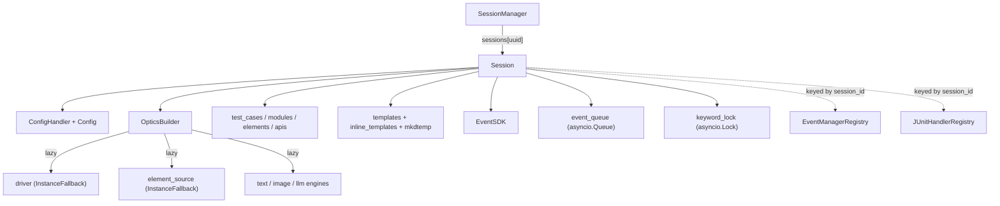

# Session Lifecycle

:material-check-circle: **Status: Current**, except the final section, which is marked *Planned*.

A `Session` (`optics_framework/common/session_manager.py`) is the unit of isolation in Optics. Everything about one test run — config, drivers, element data, templates, events, output paths — hangs off it. Understanding what it owns, and what it *doesn't*, is the key to reasoning about concurrency.

## What a Session owns

Engines are **lazily instantiated** — `OpticsBuilder.get_*()` defers construction until a keyword needs them, so a session that never locates an element never builds a `StrategyManager`.

## Creation

1. A `Config` is built (from `config.yaml` for CLI paths, or from the request body for `optics serve`).
2. `SessionManager.create_session` mints a `uuid4` and constructs a `Session`.
3. `Session.__init__` does a lot, and two parts of it have process-wide side effects:
    - `ConfigHandler(config)` **mutates the `Config` you passed in** — it sets `execution_output_path` and `os.makedirs` it. It also reconfigures **global** logging.
    - `tempfile.mkdtemp(prefix="optics_session_")` creates the per-session inline-template directory.
4. Enabled dependency configs are filtered, and the driver is built eagerly (`self.driver = self.optics.get_driver()`) so a bad config fails fast rather than at the first keyword.
5. `event_queue` and `keyword_lock` are created.

!!! warning "Never share a `Config` instance between sessions"
    `Session.__init__` mutates it. Two sessions constructed from one `Config` object will overwrite each other's `json_path` and `execution_output_path`, and any already-built handler will disagree with `session.config`. Every current entry point happens to construct a fresh `Config` per session, so this is latent rather than active — but nothing enforces it.

## Termination

`SessionManager.terminate_session` pops the session, then:

- `session.driver.terminate()` — quits the remote driver and flushes buffered events
- clears `inline_templates` and `rmtree`s the per-session temp directory (only that directory, never a parent)
- `cleanup_junit(session_id)` finalizes the JUnit XML
- removes the session's `EventManager` from the registry

Every one of those steps runs even if an earlier one raises, and the original driver error is re-raised at the end, so a driver that refuses to quit is reported to the caller without leaving anything behind.

Over HTTP, `delete_session` first looks the session up — an unknown id is a `404`, not a false `200` — then acquires `session.keyword_lock` before offloading `terminate_session` to a thread, so teardown cannot quit the driver or `rmtree` the template directory out from under an in-flight keyword. Only the acquisition is bounded (60 s); on timeout it tears down anyway, because a session that cannot be evicted holds its device until the process dies.

!!! warning "Nothing reclaims a session nobody deletes"
    `DELETE` is still the only eviction path. There is no TTL, no reaper, no heartbeat, no session cap, and no shutdown handler: a client that opens a session and disconnects holds a device indefinitely. That is Phase 4.

## Per-session vs process-global

This is the table that matters for concurrency.

### Correctly per-session

| Thing | Notes |
|---|---|
| `SessionManager` itself | Not a singleton — each entry point constructs its own. The one in `expose_api` is module-level, but it is a *manager of many* keyed by uuid, which is the right shape. |
| `ConfigHandler` | Not a singleton; holds no global config. Nothing reads config from a global. |
| `EventManagerRegistry` | Keyed by `session_id`, guarded by a `threading.Lock`. Each `EventManager` owns its own queues and subscribers. |
| `JUnitHandlerRegistry` | Same shape. Output is already `junit_output_<session_id>.xml`. |
| `EventSDK` | Constructed per session. |
| `OpticsBuilder` | `_instances` is per-builder; `build()` returns a fresh API-class instance each call. |
| `InstanceFallback` | A new one per factory call; `current_instance` is instance state. |
| `StrategyManager` and its factories | Fully per-instance. `StrategyFactory._registry` is an *instance* attribute despite the name. |
| `KeywordRegistry` | Built fresh per runner and per live controller. |
| Inline-template temp dir | `mkdtemp` per session, cleaned on terminate. |
| `test_context.current_test_case` | A `ContextVar` — correctly task-isolated. |

### Process-global, holding state that should be per-session

| Thing | What breaks with two sessions |
|---|---|
| `TreeResultPrinter._instance` | `test_state` is *replaced* wholesale per session. Session A's rows vanish; its `_update_status` then silently no-ops, so its live tree freezes with no error. Pass/fail is computed over the union of both sessions' test cases. `optics serve` dodges this by using `NullResultPrinter`. |
| `PytestRunner.instance` | A class attribute wired into a generated `conftest.py` fixture. Session A's generated tests execute against session B's runner, driver, and element data. |
| `GenericFactory._registry` | One registry shared by **all five** factory subclasses. Every terminated session's driver and OCR reader stays referenced forever. Currently a leak rather than a swap, because live paths always construct fresh — but the caching path is live code one call away from handing session B session A's driver. |
| The logging manager | Every session reconfigures global logging. See [Logging & Session Isolation](logging-and-isolation.md). |
| `Optics` (SDK facade) | `@library(scope="GLOBAL")` with a single `session_id` slot. A second `Setup` orphans the first session's driver and temp dir without terminating them. |
| The global `rich` `Console` | `force_terminal = True` is set on it permanently, and only one `Live` display may own a terminal at a time. |

## Request-scoped vs session-scoped

A distinction worth internalising, because `optics serve` used to get it wrong: **data belonging to one HTTP request must not live on the `Session`.**

Template overrides supplied with a single `POST /action` were stored in `session.request_template_overrides`, written before the session lock was taken and cleared in a `finally` outside it, so one of two concurrent requests cleared the other's entries. They now live in the module-level `request_template_overrides` `ContextVar` (`session_manager.py`), which is per-task and therefore per-request automatically, and which propagates into `asyncio.to_thread` workers where keywords actually read it. The request sets it, and its `finally` resets exactly its own token.

Its default is `None`, read as `(request_template_overrides.get() or {})`: a mutable default would be shared by every context that never calls `set()`, so a single in-place write would poison it process-wide.

See the [async model](async-model.md#why-a-per-session-executor-not-bare-to_thread) for the trap this introduces when the executor changes.

## Planned: the `SessionRecord`

:material-alert: **Status: Planned** — not implemented.

To make `optics serve` stateless, the durable part of a session is being separated from the derived part. See [Stateless Serve](stateless-serve.md) for the full design.

**Stored** — all JSON-serializable: `session_id`, `config`, `driver_kind`, a `reattach_handle` (`appium_url`, `remote_session_id`, `capabilities`), `elements` / `modules` / `test_cases` / `apis`, `inline_templates` as blob references, `created_at` / `last_accessed`, and `new_command_timeout_s`.

**Derived, never stored** — reconstructed on demand: the driver and element source, all vision and LLM engines, `OpticsBuilder`, `KeywordRegistry`, every `StrategyManager`, `EventSDK`, the JUnit handler, the `EventManager`, the lock, and the event subscription.

The schema is the contract: anything not in the stored list must be reconstructible from what is.
