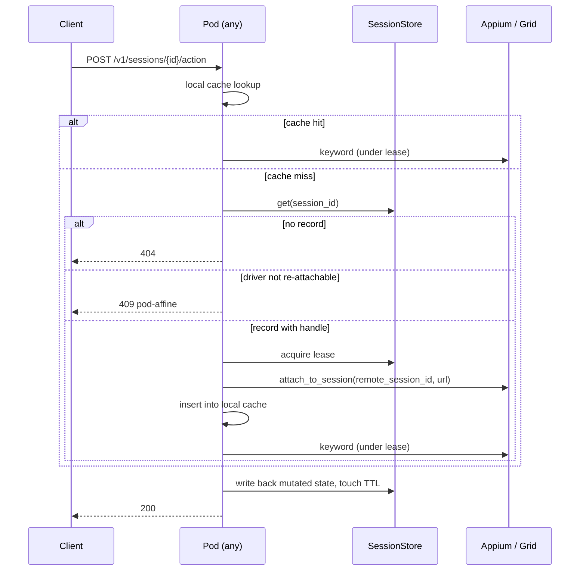

# Stateless Serve

:material-alert: **Status: Planned** — none of this is implemented. It is the agreed target design for running `optics serve` as a horizontally-scalable Kubernetes service. For what works today, see [Parallel Session Limits](parallel-session-limits.md).

Full design record: [stateless-serve design doc](../superpowers/specs/2026-08-18-parallel-sessions-stateless-serve-design.md).

## The goal

A new pod can serve a session created by a pod that no longer exists. Routing is plain round-robin — no sticky sessions, no consistent-hash ingress.

## What makes this possible

A live `webdriver.Remote` object cannot be pickled or moved between processes. But **the object and the resource are different things**, and Appium separates them cleanly.

The codebase already contains `Appium.attach_to_session`: a `SessionAttachmentWebDriver` subclass that intercepts the `newSession` command, returns a synthetic response carrying a target session id, and forces `driver.session_id` onto the client. No new remote session is created. It is already reachable from configuration — a `sessionId` / `appium:sessionId` / `existingSessionId` capability triggers an attach attempt, with fallback to creating a fresh session if the attach fails. And `launch_app` only starts a session when `self.driver is None`, so a rehydrated session will not relaunch the app underneath you.

!!! success "The durable state of an Appium session is exactly three JSON values"
    `(appium_url, remote_session_id, capabilities)`

    Everything else a `Session` holds is either derived from config or is execution data that already serializes. That is what makes statelessness reachable without moving a socket between processes.

## What can and cannot be stateless

Being honest about this matters more than the design itself, because the wrong assumption here produces an architecture that cannot work.

| Layer | Stateless? | Notes |
|---|---|---|
| HTTP request handling | :material-check: **Already is** | No request context beyond path params. |
| Keyword registry, API instances | :material-check: **Derived, not state** | A pure function of config. Caching it per session is also a performance fix. |
| Execution state (elements, modules, test cases, apis, templates) | :material-check: **Yes** | All JSON-serializable. |
| Artifacts | :material-check: **Already is for `serve`** | `save_captures=False`, screenshots returned as base64. (Modulo the bug where that flag isn't honoured everywhere — see [Resource Isolation](resource-isolation.md#save_captures-is-not-honoured-everywhere).) |
| Session registry | :material-alert: **Directory yes, object no** | You can externalize `{id → host, caps, remote driver id, TTL}`. You cannot serialize a live driver. |
| Event / SSE stream | :material-close: **No, without replacing the transport** | An in-process `asyncio.Queue`; a subscriber must land on the owning process. This is the most commonly under-scoped part of going multi-pod. |
| **Appium** driver | :material-check: **Effectively yes** | Re-attachable from the three values above. |
| **Selenium** driver | :material-alert: **~40-line port** | `get_driver_session_id` raises `NotImplementedError` and there is no attach method. The same `newSession`-interception trick applies; it just isn't written. |
| **Playwright** driver | :material-close: **No — hard constraint** | Launches its own browser subprocess in-process, driven over a pipe by a global loop thread. `get_driver_session_id` returns a constant. There is no `connect_over_cdp` path. A Playwright session is pinned to its process for life. |
| **Local USB devices** | :material-close: **No — physical, not architectural** | No amount of external state makes a USB-attached phone reachable from another host. |

**The definition adopted:** "stateless `optics serve`" means (a) no server-local *authoritative* state, (b) any instance can serve any request given the externalized handle, and (c) a process restart loses no session. This is achievable for **Appium + externalized registry + externalized event bus**. It is not achievable for in-process Playwright or locally-attached devices — those remain pod-affine, and the design refuses them explicitly rather than breaking silently.

## Architecture: three seams, two adapters each

!!! important "Redis is optional, always"
    `optics execute`, `optics live`, the SDK, and a locally-run `optics serve` must work with **zero Redis and zero configuration**. Local behaviour stays byte-identical to today. One switch selects the backend for all three seams:

    ```
    OPTICS_SESSION_BACKEND = memory | redis    # default: memory
    OPTICS_REDIS_URL       = redis://...       # only when backend=redis
    ```

    `redis-py` ships as an optional extra (`optics-framework[redis]`), imported behind a guard exactly as `fastmcp` is today.

| Seam | Local default (no dependency) | Redis adapter |
|---|---|---|
| **`SessionStore`** — the session directory and record | a dict holding the live record **by reference**; no serialization at all | one hash per session with a TTL; serialization happens only at this boundary |
| **`SessionLease`** — mutual exclusion per session | today's per-session `asyncio.Lock` | `SET NX PX` with background renewal and compare-and-delete release |
| **`EventTransport`** — fan-out to the SSE endpoints | today's in-process `asyncio.Queue` | pub/sub channel per session |

`SessionManager.sessions` demotes from *source of truth* to a **cache of live `Session` objects**. The cache exists in both modes; only authority differs.

## Rehydration



### Driver re-attach capability

`DriverInterface` gains three members so the store can tell what is movable:

```python
supports_reattach: ClassVar[bool] = False
def get_reattach_handle(self) -> dict | None: ...
@classmethod
def attach(cls, handle: dict, **kwargs) -> Self: ...
```

Appium sets `supports_reattach = True`. Playwright, Selenium, BLE, and camera inherit `False`, and the store refuses to persist a handle for them — those sessions are marked **pod-affine** and a pod that doesn't own them returns `409` with a clear message, rather than silently constructing a second unrelated driver. This is what lets the other backends keep working while the Appium path goes stateless.

## Two things that will bite

!!! danger "`newCommandTimeout` is load-bearing and nothing sets it today"
    Appium's default is 60 seconds. If a pod restart takes longer than that, the remote session is reaped, and the new pod faithfully rehydrates a handle to a session that no longer exists — surfacing as a confusing element-not-found. The record carries an explicit `new_command_timeout_s` with a deliberate default, and rehydration failure is reported as its own error code rather than as `E0201`.

    This must be tuned *together with* the session reaper: too low and sessions die between pods, too high and abandoned sessions hold devices until the reaper fires.

!!! danger "An `asyncio.Lock` protects nothing across pods"
    `session.keyword_lock` is the only thing preventing interleaved WebDriver commands today, and a WebDriver session is **not** concurrency-safe. Distributed serialization needs a distributed lease, not just a shared registry. This is why `SessionLease` is its own seam rather than a detail of the store.

## Idempotency

A pod dying mid-keyword leaves the client unable to distinguish "the tap happened" from "the tap didn't". UI actions are not idempotent, so a blind retry double-taps.

`POST /action` accepts an optional `Idempotency-Key` — the `execution_id` the server already mints becomes client-suppliable — and `(session_id, key) → response` is cached in the store with a short TTL. Included in the design because retrofitting it after the API shape settles costs more than adding it now.

## `--workers`

Today `--workers N` is advertised and **silently broken**: each worker process imports the module and gets its own in-memory registry, so a session created on worker 1 returns `404` from worker 3. Phase 0 makes it fail loudly. Once the Redis store lands, it becomes genuinely correct and is re-enabled under `OPTICS_SESSION_BACKEND=redis`.

## Deliberately out of scope

- **Authentication.** The server is treated as cluster-internal. Note that statelessness makes `session_id` a *portable, cross-node* bearer capability with no ownership check — anyone who can reach the port can drive any session, including `DELETE`. Two cheap hardening fixes (no credentialed wildcard CORS; stop logging raw capabilities) land in Phase 0; the token/principal work is tracked separately.
- **Backlog replay on SSE.** Pub/sub is fire-and-forget: a client reconnecting after a pod death gets events from that point forward, not the backlog. Redis Streams would fix it and is a follow-up.
- **Cross-pod statelessness for non-Appium backends.** See the capability table above.
